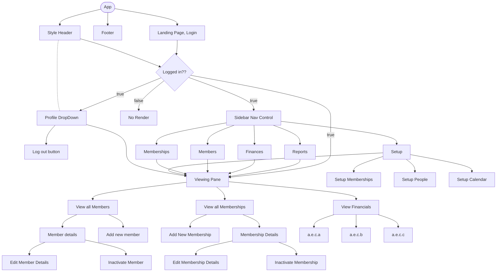

# _Simple Membership Proposal_

### Name of Student: 
**_Andy Plymate_**

### Name of Project: 
**_Simple Membership_**

### Project's Purpose or Goal: 
* _Simple Membership is a simple way to track membership information and membership status within a small hobby groups or businesses. Many small groups utilize excel to keep this information, but excel has many pain points for this work such as: authentication, selective hidden information, no error handling. Simple membership looks to bring the simplicity of an excel tracking sheet and combine it with the structure, and ease, of a web app._

### Minimum user stories to meet goal: 
* ### _Accounts_
  * _A user can register and create a profile with the following information:_
    * _Email_
    * _First Name_
    * _Last Name_
    * _Address_
    * _Phone Number_
    * _Emergency Contact Info_
    * _HEMAA Expiration date_
    * _Registration date_
  * _Users can log in and edit their own profile_
  
* ### _Account Security_
  * _Admin users can assign authority to other users_
    * _This app will have member and admin only_
  * _Members can only see their own profiles_

* ### _Memberships_
  * _Admin can create "memberships" which have the following info:_
    * _Name_
    * _Price_
    * _Billing Frequency_
      * _Single_
      * _Monthly_
      * _Quarterly_
      * _BiAnnually_
      * _Annually_
    * _Description_
    * _Membership Restrictions:_
      * _Unlimited_
      * _Limited_
        * _Classes per week_

### Technologies used for MVP: Be specific. 
* _MongoDb_
* _Express.js_
* _React_
* _Node.js_

### Stretch Goals: 
* ### _Accounts_
  * _Admin can create accounts manually for new user complete with password_
  * _User can change their password, or recover their password_
  * _Users can have reoccurring memberships with start dates and end dates_
  * _Attach files to account:_
    * _Liability Waiver_
    * _HEMAA Screenshot_

* ### _Account Security_
  * _Members can see basic information about other users_

* ### _Memberships_
  * _None yet_

* ### _Financial_
  * _Use a 3rd party app to take monies related to memberships on a reoccurring basis_
  * _Admin ability to change membership start dates, end dates, charge dates_

* ### _Calendar_
  * _Google calendar embed_

* ### _Reporting_
  * _Ability to download .csv file of all the database data_

* ### _Membership Communication_
  * _Automated emails:_
    * _Selected users by membership type or all_
    * _Welcome Email upon signing up_
    * _Payment / Membership renewal reminder_
    * _Membership expiration reminder_

* ### _User Landing Page_
  * _Classes that user has attended in the last 30 days_
  * _Upcoming events / classes_
  * _Membership enrollment status_
  * _Announcements from admin_

* ### _Attendance_
  * _Log members "attended" to a specific class on the calendar_

### Technologies used for stretch goals: 
*note: Some stretch goals are firmly in the "idea" stage and need more research and thought. They were included as part of a larger brainstorming process as possibilities. The below is in incomplete list of the tech that may be needed.*
* _Google calendar API_
* _Stripe payment processing API_

### Proposed Component Tree Map
*note: This component tree tries to envision all stretch goal as best as possible at this point. This may change as the project develops.
* [Component Tree Map](./front-end/public/mermaid-diagram-20220429162821.png)
* _Created using [Mermaid Live](mermaid.live)_
* _Mermaid code below:_

### Is there anything else you'd like your instructor to know?
* _N/A_